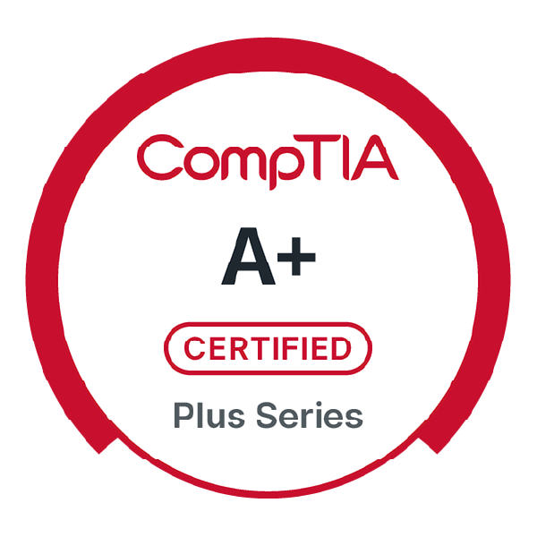

 

Hello, world!✌️😊 My name is Christa DeJesus, and I'm a Creative Technologist specializing in bringing creative visions to life with web development and digital design. Although I enjoy working on a wide range of projects, I have a passion for using my skills to amplify voices, spread awareness, and contribute to movements and organizations that lift people up and spark positive social change.

----------

<!-- BADGES -->

----------

## My Favorite Tools

----------

## Let's Connect

I believe the most powerful progress happens through connection and collaboration. Whether you're working on a campaign for social
justice, designing a tool to empower communities, or building a small business online presence from the ground up, I'd love to
join forces. Lets co'nnect, collaborate, and create something that makes a difference!

### Find me on:

- [christadejesus.com](https://christadejesus.com)
- [Codepen](https://codepen.io/christadejesus)
- [YouTube](https://youtube.com/@christad-tech)

